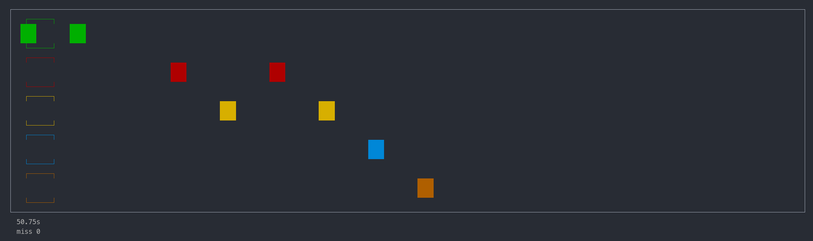

Problem
---

There are not enough fun games available on the terminal.

<!-- pause -->

What could a solution look like?

- Make it easily accessible (no download required!)
- Take inspiration from existing simple games
- Open source

<!-- end_slide -->

The Power of SSH
---

What is SSH?

- Conventionally a sysadmin tool for getting a shell on a remote server

<!-- pause -->

-> But SSH is just a protocol!

- Send encrypted bytes over TCP
- Can allocate a PTY

<!-- pause -->

And it's already used in a lot of places:

- SFTP (SSH File Transfer Protocol)
- SCP
- X11 Forwarding / Port forwarding

<!-- pause -->

What else can it do?

<!-- pause -->

This idea is not new:

- Soft Serve, a Git server
- `terminal.shop`, an online coffee company
- Various wordle clones

<!-- end_slide -->

Terminal Hero
---

- An SSH rhythm game (zero dependencies!) with audio streaming
- Able to import Guitar Hero song charts
- Written in Go with the Charm stack (Bubble Tea, Lip Gloss, Wish)

<!-- end_slide -->

Technical Challenges
---

Audio

- Text sessions can't be mixed with raw data session
  - Open multiple SSH connections, and pipe raw sound data to device
  - Coordinate the two sessions

<!-- pause -->

- Low latency, real time requirements
  - Custom audio mixing and buffering
  - Tuning and frequent testing on remote servers

<!-- pause -->

- Synchronizing with the chart (audio play rate is inconsistant)
  - Audio player drives chart progression

<!-- pause -->

Ecosystem Integration

- High diversity of files (time signature, tempo, resolution)
  - Custom parser for Guitar Hero file format

<!-- pause -->

  - Mapping between real time and file ticks

<!-- end_slide -->

Demo
---

<!-- end_slide -->

Future Work
---

- Leaderboard
- Chart search feature
- Global deployment for minimized latency
